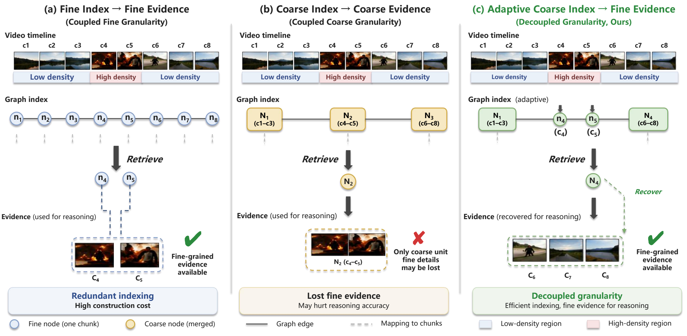
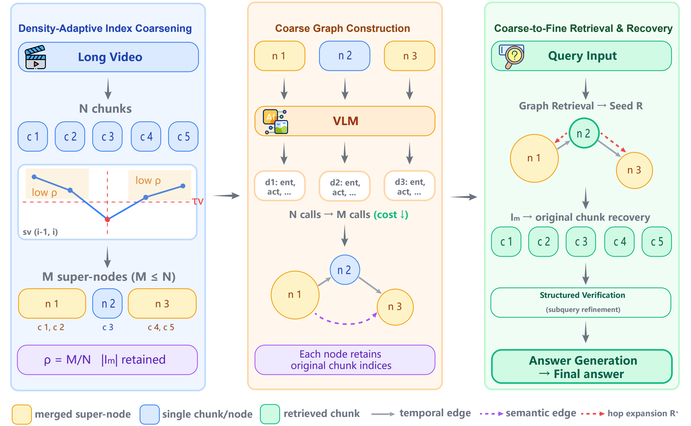

# Coarse Indexing, Fine Evidence

## Density-Aware Graph Construction for Long-Video RAG

🎞️ Density-Adaptive Coarsening | 🕸️ Compact Graph Indexing | 🔍 Fine-Evidence Recovery

> A training-free method that reduces redundant graph construction while preserving access to the original visual evidence.

---

## 🧭 Overview

<p align="center">
  
</p>


Long-video graph RAG systems commonly use the same fixed-length chunks for both indexing and reasoning. This is inefficient in visually repetitive regions and may lose important details when coarse units are used directly as evidence.

**Density-Aware Graph Construction (DAGC)** decouples these two granularities:

- **Coarse indexing:** merge visually redundant neighboring chunks into compact super-nodes.
- **Fine evidence:** retain the original chunk mapping and recover fine-grained clips after retrieval.

DAGC is training-free and can be integrated into different long-video graph RAG pipelines and vision-language models.


---

## 🧩 Framework

<p align="center">
  
</p>

The framework contains three stages:

| Stage | Description |
|---|---|
| 1. Density-Adaptive Coarsening | Merge adjacent chunks with high visual redundancy under a bounded temporal span. |
| 2. Coarse Graph Construction | Build graph semantics only for the resulting super-nodes using a fixed visual budget. |
| 3. Fine-Evidence Recovery | Expand retrieved super-nodes back to their original chunks before verification and answering. |

Each super-node stores:

```text
original_indices
span_start
span_end
num_merged
```

This allows the graph to remain compact without permanently replacing the evidence used for reasoning.

---

## ✨ Highlights

- **Training-free:** no additional segmentation or compression model is required.
- **Framework-agnostic:** DAGC changes indexing units while preserving the host system's graph semantics and retrieval logic.
- **Fixed per-node cost:** merged super-nodes are uniformly sampled to the same frame budget as an original chunk.
- **Recoverable evidence:** retrieved nodes are mapped back to original chunks for fine-grained verification.
- **Cache-safe:** graph caches are separated by chunk size, similarity threshold, merge span, and boundary configuration.

---

## 📊 Key Results

Across MLVU, VideoMME, and LongVideoBench, DAGC:

- retains approximately **40-50%** of the original indexing units;
- provides approximately **1.3-1.7x** end-to-end acceleration;
- preserves approximately **99%** of the original QA performance.

At the same 47% retained-node budget on LongVideoBench:

| Coarsening Strategy | Accuracy | Retained Nodes |
|---|---:|---:|
| Random Merge | 61.53 | 47% |
| Uniform Merge | 62.28 | 47% |
| **DAGC** | **63.07** | **47%** |

---

## 📦 Repository Structure

```text
.
├── assets/                         # README figures
├── models/                         # Vision-language model adapters
├── scripts/                        # Launchers and result utilities
├── tests/                          # Boundary and merge tests
├── utils/
│   ├── dagc.py                     # DAGC and graph-RAG integration
│   ├── boundary_segmentation.py    # Optional boundary signals
│   ├── config.py                   # Command-line arguments
│   ├── data.py                     # Dataset readers
│   ├── prompts.py
│   └── retrieval.py
├── dagc_rag.py                     # Distributed evaluation entry point
└── requirements.txt
```

---

## 🚀 Quick Start

### Installation

Install PyTorch for your CUDA environment, then run:

```bash
pip install -r requirements.txt
pip install flash-attn --no-build-isolation
```

### Paths

```bash
export DATA_PATH=/path/to/MLVU
export MODEL_PATH=/path/to/Qwen2.5-VL-7B-Instruct
export EMBEDDING_PATH=/path/to/bge-large-en-v1.5
```

### Run

```bash
bash scripts/run_mlvu_needle.sh \
  dagc \
  ./outputs/mlvu_needle/dagc \
  ./graphs/mlvu_needle/dagc \
  4
```

The final argument specifies the number of distributed processes. Use a separate graph directory for every configuration.

### Test

```bash
python -m py_compile dagc_rag.py utils/*.py models/*.py scripts/*.py
pytest -q tests/test_boundary_segmentation.py
```

---

## ⚙️ Main Configuration

| Argument | Default | Description |
|---|---:|---|
| `--chunk_size` | 64 | Frames in each original chunk |
| `--adjacent_sim_threshold` | 0.95 | Adjacent redundancy threshold |
| `--max_supernode_span` | 4 | Maximum original chunks per super-node |
| `--supernode_target_frames` | 64 | Visual frame budget for each super-node |
| `--top_seed_k` | 12 | Initial coarse retrieval seeds |
| `--original_expand_hop` | 1 | Temporal expansion after recovery |
| `--mlvu_task` | unset | Case-insensitive MLVU subset filter |

The default setup samples video at 1 FPS. Model checkpoints and datasets are not included in this repository.

---

## 📄 License

Please add the license and copyright notice required by the original implementation before redistribution. Model and dataset licenses apply separately.
